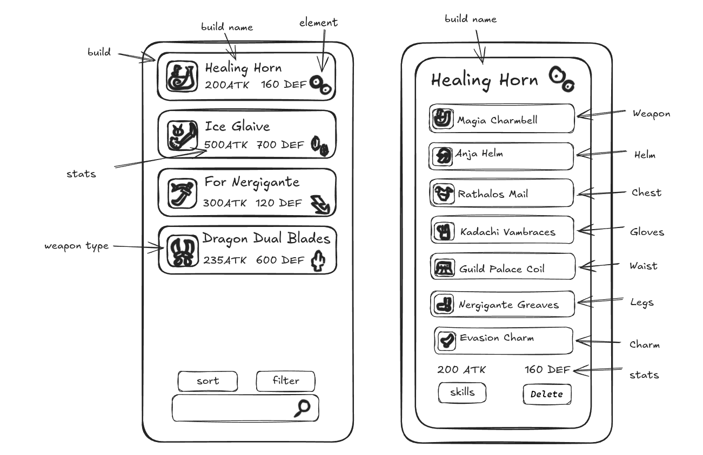
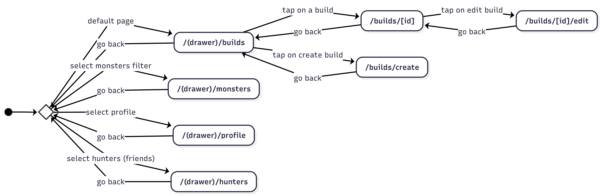
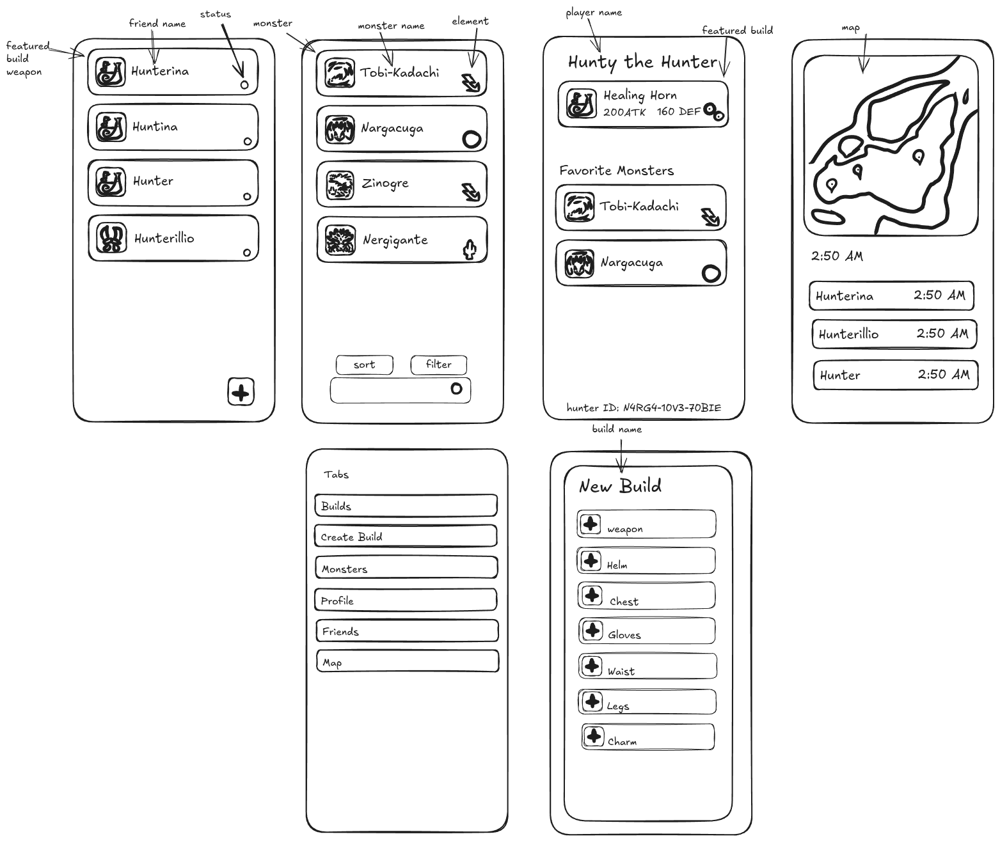
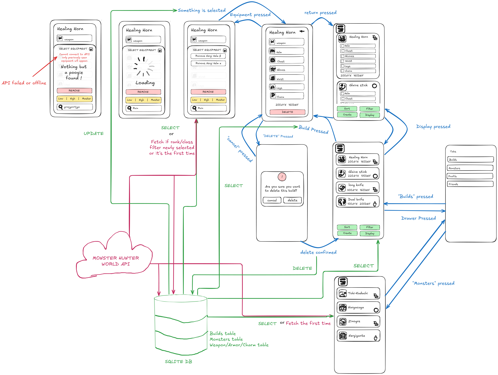

# Project Proposal

## Part 1

### App Concept
An app where you can make equipment builds for the game "Monster Hunter World". This would be used by players to keep track of different builds for different situations. Example: A build to use when hunting a specific monster with a specific weapon.

### main interface
```
interface Build {
    id: string;
    name: string;
    weapon: string; // will be replaced with weapon object
    helm?: string; // will be replaced with armor object
    chest?: string; // will be replaced with armor object
    gloves?: string; // will be replaced with armor object
    waist?: string; // will be replaced with armor object
    legs?: string; // will be replaced with armor object
    charm?: string; // will be replaced with decoration object
    decorations: list[string]; // will be replaced with decoration object
    usage: list[string]; // will be replaced with monster object
}
```

### UI Sketches


### Component List
- `BuildList`: Renders a flatlist of builds
- `BuildCard`: Displays details of build
- `BuildEquipmentList`: Renders a list of equipment used in a build
- `EquipmentCard`: Displays equiment detail
- `AddBuildForm`: Form to create build
- `EquipmentSelector`: Shows a list of equipment you can use in the build
- `FilterSelector`: Selector to filter by element, by monster, by weapon type, name or skill
- `SortSelector`: Selector to sort by damage, defense, alphabetically or skill

### Filter Options
Filters:
- Builds: Element / Monster / Weapon Type / Name
- Equipment: Skill / Decoration Slots / Name

Sorting: 
- Builds: Damage / Defense / Alphabetically[A-Z, Z-A] / Skill
- Equipment: Damage / Defense / Alphabetically[A-Z, Z-A] / Skill

## Part 2

### Route Plan
/ -> Root (redirects to /(drawer)/builds)

##### Main Routes
/(drawer)/builds -> main screen

/(drawer)/monsters -> to see associated weapons

/(drawer)/profile -> user information (not to be implemented yet)

/(drawer)/hunters -> friends(not to be implemented yet)

/(drawer)/map -> to view hunter friends locations (no to be implemented yet)

##### Item level

/builds/[id] -> build detail (dynamic route)

/builds/[id]/edit -> Edit screen (dynamic route)

##### Other routes

/builds/create -> Create modal (presented over current screen)

### State Diagram


### UI Sketches
Editbuild screen and detailedBuild screen which will look like the card from part 1.


## Part 3

### SQLite Schema

``` sql
CREATE TABLE IF NOT EXISTS weapons (
    id INTEGER PRIMARY KEY,
    name TEXT NOT NULL,
    weapon_type TEXT NOT NULL CHECK (weapon_type IN ("greatsword" , "longsword" , "sword_and_shield" , "dual_blades", "hammer" , "hunting_horn" , "lance" , "gunlance" , "switch_axe", "charge_blade" , "insect_glaive" , "light_bowgun" , "heavy_bowgun" , "bow")),
    element TEXT NOT NULL CHECK (element IN ("raw", "fire", "thunder", "dragon", "water", "ice", "blast", "paralysis", "poison", "sleep")),
    attack INTEGER NOT NULL
);

CREATE TABLE IF NOT EXISTS monsters (
    id INTEGER PRIMARY KEY,
    name TEXT NOT NULL,
    element TEXT NOT NULL CHECK (element IN ("raw", "fire", "thunder", "dragon", "water", "ice", "blast", "paralysis", "poison", "sleep")),
    classification TEXT NOT NULL CHECK (classification IN ("bird wyvern" , "brute wyvern" , "fanged wyvern" , "fanged beast", "flying wyvern" , "piscine wyvern" , "relict" , "elder dragon"))
);

CREATE TABLE IF NOT EXISTS armor (
    id INTEGER PRIMARY KEY,
    name TEXT NOT NULL,
    armor_type TEXT NOT NULL CHECK (armor_type IN ("helm" , "chest" , "gloves" , "waist", "legs")),
    defense INTEGER NOT NULL
);

CREATE TABLE IF NOT EXISTS charms (
    id INTEGER PRIMARY KEY,
    name TEXT NOT NULL
    skill_id INTEGER

    FOREIGN KEY(skill_id) REFERENCES skills(id)
);

CREATE TABLE IF NOT EXISTS skills (
    id INTEGER PRIMARY KEY,
    name TEXT NOT NULL
    max_level INTEGER
);

CREATE TABLE IF NOT EXISTS armor_skills (
    armor_skills INTEGER PRIMARY KEY AUTOINCREMENT,
    armor_id INTEGER,
    skill_id INTEGER,
    skill_level INTEGER
    FOREIGN KEY(armor_id) REFERENCES armor(id),
    FOREIGN KEY(skill_id) REFERENCES skills(id)
);

CREATE TABLE IF NOT EXISTS builds (
    id INTEGER PRIMARY KEY AUTOINCREMENT,
    name TEXT NOT NULL,
    weapon_id INTEGER NOT NULL,
    helm_id INTEGER,
    chest_id INTEGER,
    gloves_id INTEGER,
    waist_id INTEGER,
    legs_id INTEGER,
    charm_id INTEGER,

    FOREIGN KEY(weapon_id) REFERENCES weapons(id),
    FOREIGN KEY(helm_id) REFERENCES armor(id),
    FOREIGN KEY(chest_id) REFERENCES armor(id),
    FOREIGN KEY(gloves_id) REFERENCES armor(id),
    FOREIGN KEY(waist_id) REFERENCES armor(id),
    FOREIGN KEY(legs_id) REFERENCES armor(id),
    FOREIGN KEY(charm_id) REFERENCES charms(id),
);

CREATE TABLE IF NOT EXISTS builds_target_monsters (
    builds_target_monsters_id INTEGER PRIMARY KEY AUTOINCREMENT,
    build_id INTEGER,
    monster_id INTEGER,
    FOREIGN KEY(build_id) REFERENCES builds(id),
    FOREIGN KEY(monster_id) REFERENCES monsters(id)
);
```

### API Integration Plan

#### Armor
- Endpoints:
    - `https://mhw-db.com/armor`
    - `https://mhw-db.com/armor/{id}`
- Data: 
    - id
    - name
    - armor type
    - defense
    - skills
- Cache Strat: Data is kept forever as it does not change
- Update Logic: Check cache first, if not found then fetch
- User-Created Data: Can be added to a build

#### Weapon
- Endpoints:
    - `https://mhw-db.com/weapons`
    - `https://mhw-db.com/weapons/{id}`
- Data: 
    - id
    - name
    - weapon type
    - attack
    - element
- Cache Strat: Data is kept forever as it does not change
- Update Logic: Check cache first, if not found then fetch
- User-Created Data: Can be added to a build

#### Charm
- Endpoints:
    - `https://mhw-db.com/charms`
    - `https://mhw-db.com/charms/{id}`
- Data: 
    - id
    - name
    - skill
- Cache Strat: Data is kept forever as it does not change
- Update Logic: Check cache first, if not found then fetch
- User-Created Data: Can be added to a build

#### Skills
- Endpoints:
    - `https://mhw-db.com/skills`
    - `https://mhw-db.com/skills/{id}`
- Data: 
    - id
    - name
    - max level
- Cache Strat: Data is kept forever as it does not change
- Update Logic: Check cache first, if not found then fetch
- User-Created Data: None

#### Monsters
- Endpoints:
    - `https://mhw-db.com/monsters`
- Data: 
    - id
    - name
    - element
    - classification
- Cache Strat: Data is kept forever as it does not change
- Update Logic: Fetch on first view, check cache age on subsequent views
- User-Created Data: Can be linked to builds

### UI Sketches

link: https://excalidraw.com/#json=wU8CoNvtojsPuayV_eMgO,qtyQWVgmNoOiNQ0MVo-G7w

